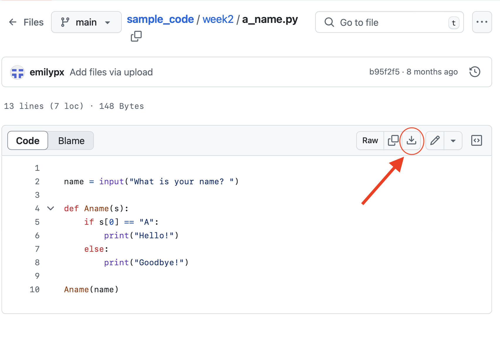

## Sample Code

Here is where you can find the code that we write in class, along with other useful code for you to consult as you complete your problem sets. It will be organized by week. 

To download and run one of the programs, open the `.py` file in GitHub and then click the little download icon, as shown in this picture:

You can clone this repo just like you clone problem set repos, and then check for updates each week. You can also  download the current repository by clicking the green Code button, and then selecting Download zip.

To practice your programming, I recommend trying to solve each problem from class by yourself, and then checking your answer against the sample code. If you are consulting the code while you work on a problem set, I recommend opening the program in GitHub, and then typing the code yourself rather than copying and pasting. This will give you practice writing code, and you will learn to be very careful. 
